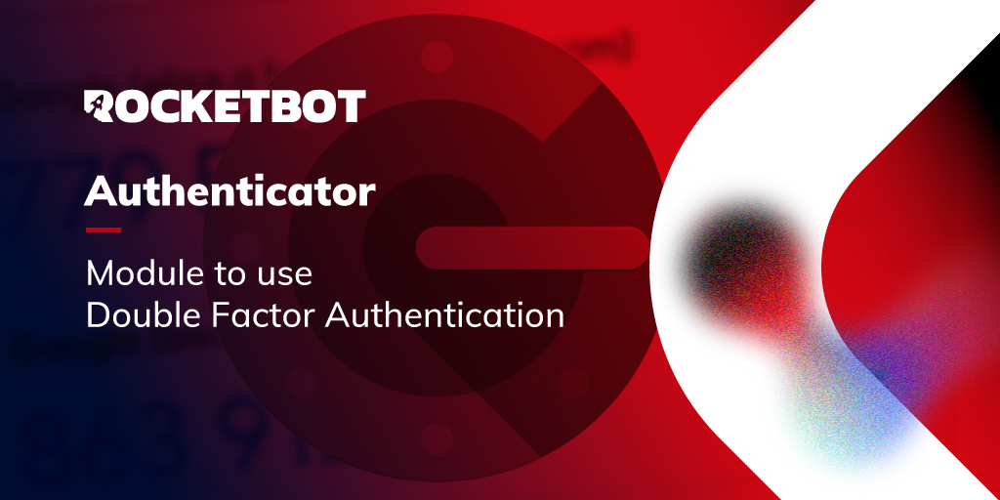

# authenticator
  
Obtenha o código de Fator de Autenticação Dupla do tipo TOPT (Time-based One Time Password) como Google and Microsoft Authenticator  

*Read this in other languages: [English](Manual_authenticator.md), [Português](Manual_authenticator.pr.md), [Español](Manual_authenticator.es.md)*
  

## Como instalar este módulo
  
Para instalar o módulo no Rocketbot Studio, pode ser feito de duas formas:
1. Manual: __Baixe__ o arquivo .zip e descompacte-o na pasta módulos. O nome da pasta deve ser o mesmo do módulo e dentro dela devem ter os seguintes arquivos e pastas: \__init__.py, package.json, docs, example e libs. Se você tiver o aplicativo aberto, atualize seu navegador para poder usar o novo módulo.
2. Automático: Ao entrar no Rocketbot Studio na margem direita você encontrará a seção **Addons**, selecione **Install Mods**, procure o módulo desejado e aperte instalar.  

## Descrição do comando

### Obter código
  
Obtenha o código de autenticação.
|Parâmetros|Descrição|exemplo|
| --- | --- | --- |
|Secret|Digite a senha.|secret32|
|Número de dígitos (opcional)|Quantidade de dígitos que terá o código retornado.|6|
|Intervalo|Quantidade de dígitos que terá o código retornado.|30|
|Atribuir resultado a variável|Atribuir resultado da conexão a variável.|result|
